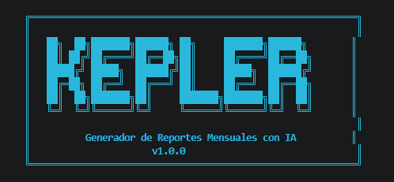

     

# 🚀 Kepler CLI

A custom CLI tool to generate professional monthly work reports from your Git activity using AI.

---

## 📌 Description

Kepler CLI is a command-line tool designed to:

* Navigate your local file system safely
* Detect and work with Git repositories
* Extract commit history
* Transform commits into structured data (JSON) using AI
* Generate monthly reports in Word (`.docx`)
* Use AI to enhance and summarize development activity

---

## ⚙️ Features

### ✅ Implemented

* Interactive CLI interface
* Custom command system
* Safe terminal command execution
* Directory navigation (`cd`, `ls`, `pwd`, etc.)
* Permission control for system access
* Git commit extraction
* AI integration for commit analysis and summarizing
* **Monthly report generation in Word (`.docx`)**

### 🚧 In Progress

* Smart filtering of commits

---

## 🛠️ Environment Setup

Before running the CLI, you need to set up your environment variables. Create a `.env` file in the root directory:

```env
# Google Gemini API Key (Required)
GEMINI_API_KEY=your_api_key_here

# AI Model Configuration (Optional, defaults to gemini-2.5-flash)
GEMINI_MODEL=gemini-2.5-flash

# Report Information (Optional)
COMPANY_NAME=Your Company
PROJECT_NAME=Project Name
EMPLOYEE_NAME=Your Name
```

---

## 📝 Configuration & Prompts

### ⚙️ System Config
The project uses a structured configuration system located in `config/`. It handles API authentication, model selection, and report settings. Environment variables are supported for development, and persistent configuration support is available through `config_impl.py`.

### 🧠 AI Prompts
The core logic for report generation relies on Markdown templates. 
* **Default Prompt:** The system reads from `prompts/generate_summary.md` by default. **You must ensure this file exists.**
* **Customization:** You can modify this file to change how the AI summarizes your commits, the tone of the report, or the specific sections required. 
* **Variables:** The prompt template supports dynamic placeholders like `{commits_data}`, `{period_month}`, and `{company_name}` which are replaced during execution.

---

## 🖥️ CLI Commands

| Command  | Description                  |
| -------- | ---------------------------- |
| generate | Generate report from commits |
| config   | Show current configuration   |
| version  | Show CLI version             |
| help     | Show help menu               |

---

## 📂 Project Structure

```
cli-kepler/
├── cli/
│   ├── welcome.py
│   └── commands.py
├── config/
│   ├── config.py
│   └── prompt_config.py
├── prompts/
│   └── generate_summary.md
├── service/
│   └── ai_service.py
├── utils/
│   ├── date_util.py
│   ├── git_util.py
│   └── write_markdown.py
├── main.py
└── README.md
```

---

## 🧠 How It Works

1. User navigates to a project directory
2. CLI detects Git repository
3. Extracts commit history from the specified period
4. Processes commits and sends them to Gemini AI using the template in `prompts/generate_summary.md`
5. AI generates a structured summary (JSON)
6. CLI converts the data into a professional Word report (`.docx`)

---

## ⚡ Installation

```bash
# Clone repository
git clone https://github.com/Froggap/kepler-cli.git

# Enter project
cd kepler-cli

# Create virtual environment
python -m venv venv

# Activate (Windows)
venv\Scripts\activate

# Install dependencies
pip install -r requirements.txt

# Set up your .env file
# (Create manually or copy from an example if available)
```

---

## ▶️ Usage

```bash
python main.py
```

Then use commands like:

```bash
cd your-project
generate
```

Generated artifacts:

```bash
commits.json
reporte_<mes>_<año>.docx
```

Current additions related to report generation:

* `config/config_impl.py`
* `service/word_service.py`

---

## 📌 Notes

* The CLI only executes **safe read-only commands**
* No source files are modified
* Works best inside a Git repository

---

## 🔮 Future Plans

* Multi-language support
* Better terminal UX (autocomplete, history)
* Switch IA models
* Generate and send reports by email

---

## 👨‍💻 Author

Built by Froggap 🚀

---

## 📄 License

MIT License © 2026 Froggap

Free to use, modify and distribute with attribution.
