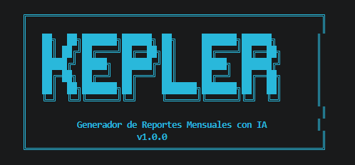

     

# 🚀 Kepler CLI

A custom CLI tool to generate professional monthly work reports from your Git activity using AI.

---
## 📌 Description

Kepler CLI is a command-line tool designed to:

- Navigate your local file system safely
- Detect and work with Git repositories
- Extract commit history
- Transform commits into structured data (JSON) using AI
- Generate monthly reports in Word (`.docx`)
- Use AI to enhance and summarize development activity

---

## ⚙️ Features

### ✅ Implemented

- Interactive CLI interface
- Custom command system
- Safe terminal command execution
- Directory navigation (`cd`, `ls`, `pwd`, etc.)
- Permission control for system access
- Git commit extraction
- AI integration for commit analysis and summarizing
- **Monthly report generation in Word (`.docx`)**

### 🚧 In Progress

- Smart filtering of commits

---

## 🛠️ Environment Setup

Before running the CLI, you can set environment variables in a `.env` file in the root directory:

```env
# Google Gemini API Key (Required)
GEMINI_API_KEY=your_api_key_here

# AI Model Configuration (Optional, defaults to gemini-2.5-flash)
GEMINI_MODEL=gemini-2.5-flash

# Report Information (Optional)
COMPANY_NAME=Your Company
PROJECT_NAME=Project Name
EMPLOYEE_NAME=Your Name
```

---

## 📝 Configuration & Prompts

### ⚙️ System Config
The project uses a structured configuration system located in `config/`. It handles API authentication, model selection, and report settings. Environment variables are supported for development, and persistent configuration support is available through `config_impl.py`.

### 🧠 AI Prompts
The core logic for report generation relies on Markdown templates.
- **Custom Prompt:** If present, the CLI reads `prompts/generate_summary.md`.
- **Fallback Template:** If that file does not exist, Kepler uses `prompts/generate_summary.example.md`.
- **Customization:** Create your own `prompts/generate_summary.md` following the structure of the example file.
- **Variables:** The prompt template supports placeholders like `{commits_data}`, `{period_month}`, `{company_name}`, `{employee_name}`, and `{project_name}`.

---

## 🖥️ CLI Commands

| Command  | Description                  |
| -------- | ---------------------------- |
| generate | Generate report from commits |
| config   | Show current configuration   |
| version  | Show CLI version             |
| help     | Show help menu               |
| uninstall | Remove local configuration and uninstall package |

---

## 📂 Project Structure

```
cli-kepler/
├── cli/                # CLI logic and interface
│   ├── app_info.py     # Version and app metadata
│   ├── commands.py     # Command definitions
│   ├── entrypoint.py   # Main CLI execution flow
│   └── welcome.py      # Welcome messages and UI
├── config/             # Configuration management
│   ├── config.py       # Config interfaces
│   ├── config_impl.py  # Implementation of persistent config
│   └── prompt_config.py # AI prompt loading logic
├── prompts/            # AI Prompt templates
│   ├── generate_summary.example.md
│   └── generate_summary.md (optional, user-defined)
├── service/            # Core business logic
│   ├── ai_service.py   # Gemini AI integration
│   └── word_service.py # Word report (.docx) generation
├── utils/              # Helper functions
│   ├── date_util.py
│   ├── git_util.py
│   └── write_markdown.py
├── main.py             # Entry point script
├── pyproject.toml      # Project dependencies and packaging
└── README.md
```

---

## 🧠 How It Works

1. User navigates to a project directory.
2. CLI detects Git repository.
3. Extracts commit history from the specified period.
4. Processes commits and sends them to Gemini AI using the template in `prompts/generate_summary.md`.
5. AI generates a structured summary (JSON).
6. CLI converts the data into a professional Word report (`.docx`) using the `word_service`.

---

## ⚡ Installation Guide (End User)

If you are not a developer and just want to use Kepler to generate reports, follow these steps:

### 1. Prerequisites
- **Python 3.10 or newer:** https://www.python.org/downloads/. IMPORTANT: On Windows, check "Add Python to PATH" during installation.
- **Git:** https://git-scm.com/downloads. Required for Kepler to read your commits.

### 2. Install Kepler
Open a terminal (PowerShell or CMD on Windows) and run:

```bash
pip install git+https://github.com/Froggap/kepler-cli.git
```

### 3. Initial Configuration (Required)
Kepler needs a Google Gemini API key to use the AI features:

1. Obtain an API Key from Google AI Studio: https://aistudio.google.com/app/apikey.
2. In your terminal run:
    ```bash
    kepler config --set-key
    ```
3. Paste your key when prompted (input is hidden for security).

### 4. Update
To update Kepler without losing your configuration, run:
```bash
kepler update
```

---

## 🛠️ Troubleshooting & Important Notes

### 1. "kepler" is not recognized as an internal command
If the `kepler` command is not found after installation, the Python Scripts folder might not be in your system PATH.
- **Solution:** Locate where Python installed scripts (usually `C:\Users\YOUR_USER\AppData\Roaming\Python\Python3x\Scripts`) and add that folder to your PATH environment variable.

### 2. Conflicts with OneDrive and synced folders
If you work inside OneDrive, Dropbox, or Google Drive folders:
- **File locking:** These services can lock the `.docx` file while syncing, causing Kepler to fail saving the report.
- **Long paths:** OneDrive can create very long paths that exceed Windows path limits (260 characters).
- **Recommendation:** Run Kepler on projects located in local paths such as `C:\Projects\my-repo`.

### 3. Secure Storage Error (Keyring)
Kepler stores your API key in the Windows Credential Manager so you don't need to re-enter it each time.
- If you get an error related to `keyring` or backend issues, ensure you have the proper permissions or set the key directly in a local `.env` file in the folder where you run the command:
    ```env
    GEMINI_API_KEY=your_key_here
    ```

### 4. Running Inside Git Repositories
Kepler must be executed inside a Git repository. If the current folder does not contain a `.git` folder, the `generate` command will fail because there is no commit history to analyze.

---

## 🛠️ For Developers (Local Installation)
If you want to contribute or customize the behavior:

```bash
git clone https://github.com/Froggap/kepler-cli.git
cd kepler-cli
python -m venv venv
# Windows:
.\venv\Scripts\activate
# Linux/macOS:
source venv/bin/activate

pip install -e .
```

---

## ▶️ Usage

```bash
kepler
```

Then use commands like:

```bash
cd your-project
generate
```

You can also run configuration directly:

```bash
kepler config --set-key
kepler config --output-path C:\Users\YourUser\Documents\Reports
```

Generated artifacts:

```bash
commits.json
report_<month>_<year>.docx
```

Current additions related to report generation:

- `config/config_impl.py`
- `service/word_service.py`

---

## 🔧 Uninstall
If you want to remove local configuration and uninstall the package, you have two options:

1. Use the interactive command inside the CLI:

```bash
kepler uninstall
```

This command offers options to remove the stored API key, the commits cache (`~/.kepler/commits.json`), generated reports and, optionally, run `pip uninstall kepler-cli`.

2. Manual uninstall:

```bash
pip uninstall kepler-cli
# and, if you want to clear local configuration:
rm -rf ~/.kepler
```

Be careful deleting `~/.kepler` as it contains persistent settings and the commits cache.

## 📌 Notes

- The CLI only executes **safe read-only commands**
- No source files are modified
- Works best inside a Git repository

---

## 🔮 Future Plans

- Multi-language support
- Better terminal UX (autocomplete, history)
- Switch AI models
- Generate and send reports by email

---

## 👨‍💻 Author

Built by Froggap 🚀

---

## 📄 License

MIT License © 2026 Froggap

Free to use, modify and distribute with attribution.
